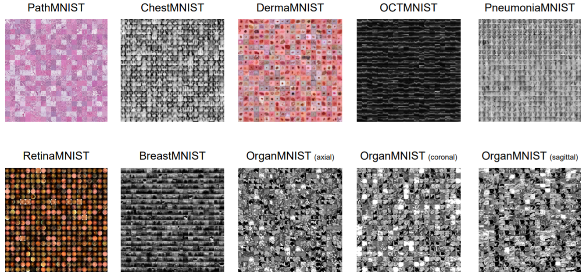

# Elastic deformation invariance in medical imaging

In the field of medical imaging, acquiring training data is in general costly, especially for rare conditions or when data labeling needs to be done by medical specialist. It is therefore important to use available data in an efficient way when training a model. Existing methods often apply data augmentation, such as image transformation, to increase the amount of data. More recent literature is focussed on semi-supervised learning techniques to increase model accuracy by increasing the data efficiency. In this project, we have applied a siamese neural network [1] to learn elastic deformation invariance on medical data, with the goal of thereby increasing the prediction accuracy for image classification with limited data availability. 

## Methods

### MedMNIST
MedMNIST is a collection of ten medical imaging datasets. Following the approach by the MNIST dataset, the images in this dataset have been standardized and preprocessed to 28x28 pixel images with the goal of making a lightweight standardized classification dataset. These ten datasets are of different modalities, ranging from organ classification (OrganMNIST) to disease classification in chest x-ray images (ChestMNIST). This thereby makes it possible to test a classification approach on a wide range of data. We have chosen this collection of datasets because it allows for rapid prototyping and training without the need of day-long computations. Moreover, the field of medical imaging is a natural application domain for our proposed method: consistency under elastic deformation.
 
 

### Elastic deformation
The choice for learning equivariance under elastic deformation was based on promising results by [4] on the JSRT X-ray dataset. We hypothesis that with elastic deformation we can model anatomical variations that are present between patients or even between images of the same patient in subtly different positions. For this reason, we expect that such a siamese network learning equivariance under elastic deformation would also increase performance on other datasets, such as MedMNIST. We especially expect good results in the OrganMNIST sub-dataset, as in CT scans the organs might be deformed a little due to the way a patient is positioned or, again, due to anatomical difference between patients.

### Architecture
In the paper by [2] the authors provide performance of baseline models, among others ResNet-18 or ResNet-50, on their datasets. In order to be able to compare our results with the baseline, we will also use a ResNet-18 as our model architecture. The only changes we make are in the way the model is trained and the way the loss function is defined, namely as a Siamese Network.

## Results

### Training epochs curve
Plots of number of epochs vs auc and accuracy of method: based on this, we have chosen that 25 epochs should be enough.

### Hyperparameter search
In our current architecture and network training method we have two hyperparameters: σ and α. σ denotes the degree to which we deform input images when training for consistency. More specifically the elastic deformation method we use requires an input of normally distributed noise, and σ denotes the standard deviation of this normal distribution. A higher value for σ results in more strongly deformed input images, which means that our network will try to learn invariance to strong deformations. On the other hand, lower σ-values will teach the network invariance to more subtle deformations. α is a measure for how large the influence of the consistency loss is relative to the supervised loss based on the training labels. Higher values for α will make the network prioritize consistency under elastic deformation more, over correct predictions. For lower α values it's the other way around.

In order to find the right combination of α and σ values, we perform a grid search on the BreastMNIST dataset. In a grid search we train and test our model with α values ranging from \[0.2, 0.4, ..., 2.0\] and σ-values ranging from \[0.30, 0.35, ..., 0.50\]. σ-values from \[0.05, 0.10, ..., 0.25\] were considered suboptimal based on a previous experiment (data not shown) and excluded from the grid-search. Each model is trained on the train set (70% of the data) and validated on the validation set (10% of the data). The accuracies and ROC AUC values achieved by each trained model are shown below:

Both the accuracies as well as the AUC values are important measures for the performance of our model. For this reason we determine the average between the accuracy and the AUC for each model (data not shown), and subsequently the best model is chosen based on which average is the highest. The optimal hyperparameters are the ones of the best model, which turns out to be α = 1.0 and σ = 0.35. We will use these hyperparameter settings for other datasets as well.

### Training data curve
We have the hypothesis that our semi-supervised training method will work especially well in the low-data regime. Our technique will help to enforce consistency of classification under elastic deformation, and will therefore be especially helpful in situations where there is only a limited amount of training data available. We have tested this by training our model with various amounts of training data available, ranging from 20% to 100% of the BreastMNIST dataset. We then compare the results achieved using the original training method and our siamese network approach, to see how their performance degrades when there is a smaller amount of data available. These results are shown in the figures below, where we take the average over 5 training runs to counteract stochasticity in training.

In the figure, we can see that the performance of both methods naturally degrades for smaller amounts of data. We do however see a significant difference in the relative degradation of both methods: while the original training model achieves an accuracy of only 36% on 20% of the training data, our proposed method still scores 'okay' with an accuracy of 70%. A similar difference can be seen for the Area Under Curve performance. Moreover, it seems that enforcing the elastic deform consistency using our chosen parameters in general achieves a slightly higher accuracy and AUC than without this method, regardless of the amount of training data available.

### Comparison with baseline
We have also looked if our elastic deformation consistency method outperforms the original training method on all four datasets. In the previous subchapter, we have already seen that this holds for the BreastMNIST dataset, but because the four datasets are of different modalities, it might be interesting to see if we can come to any general conclusions. We have therefore trained models following the original or elastic deformation method on 20% of the training data available, which is the data-regime on which we think our method might be the most beneficial. The 5-run accuracy and AUC performance have been summarized in the table below.

From this table, we see that our method achieves the highest improvement on the BreastMNIST dataset. Moreover, it achieves a slight improvement on the PneumoniaMNIST and OrganMNIST dataset, while it is slightly outperformed on the ChestMNIST dataset. It is however hard to say conclude what causes these performance differences: this could be because elastic deformation consistency in general holds the most for the BreastMNIST dataset, although this is not what we hypothesized. Another explanation could be because we have tuned the α and σ hyperparameters specifically on the BreastMNIST dataset, and that these values do not generalize to the other datasets.

### Discussion
- Difference between sigma=alpha=0 and original: due to loss function
- We have validated that we can reproduce original results with original method

## Conclusions

## References
[1] Chicco, Davide. "Siamese neural networks: An overview." Artificial Neural Networks (2021): 73-94.

[2] Yang, J., Shi, R., Ni, B., 2021. "MedMNIST Classification Decathlon: A Lightweight AutoML Benchmark for Medical Image Analysis", in: 2021 IEEE 18th International Symposium on Biomedical Imaging (ISBI).

[3] LeCun, Y. Cortes, C. and Burges, C.J.C. "The MNIST database of handwritten digits". http://yann.lecun.com/exdb/mnist/

[4] Bortsova G., Dubost F., Hogeweg L., Katramados I., de Bruijne M. (2019), "Semi-supervised Medical Image Segmentation via Learning Consistency Under Transformations." In: Shen D. et al. (eds) Medical Image Computing and Computer Assisted Intervention – MICCAI 2019. MICCAI 2019. Lecture Notes in Computer Science, vol 11769. Springer, Cham. https://doi.org/10.1007/978-3-030-32226-7_90
